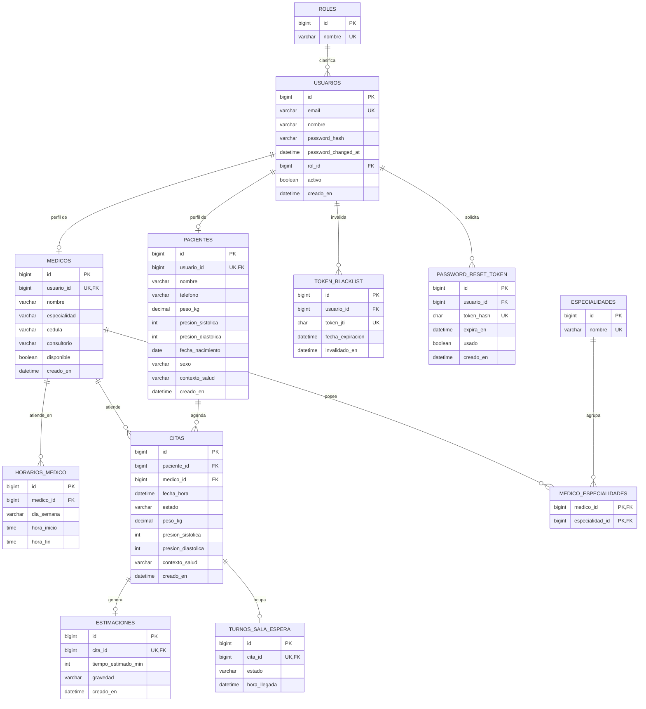

# SaludOAX

Sistema de gestión de citas médicas para centros de salud del estado de Oaxaca, con estimación
de tiempo de consulta y clasificación de gravedad asistida por IA.

Resuelve un problema real: en clínicas sin tiempo estimado por consulta, los pacientes no saben
cuánto falta para su turno y pierden su lugar por ausentarse brevemente. SaludOAX calcula una
estimación por cita a partir de los signos vitales y el motivo de consulta, y ordena la sala de
espera por triage clínico en lugar de por orden de llegada.

- **Aplicación:** https://saludoax.me
- **API:** https://saludoax.me/api
- **Tablero Kanban:** https://github.com/users/LuisEduardoChavezLjx/projects/2
- **Prototipo Figma:** https://www.figma.com/design/ccBobNVwGxbSMLKxC851Dj/Prototipo_SaludOax?node-id=0-1&t=L6TcQcoGXb4pkO4B-1

## Integrantes

| Integrante | Responsabilidad |
|---|---|
| Cruz Bautista Mauricio Raciel | Flujo B — Médicos, estimación IA y sala de espera |
| Chavez Hernandez Luis Eduardo | Flujo A — Pacientes y agendamiento de citas |

## Tecnologías utilizadas

| Capa | Tecnología |
|---|---|
| Backend | Spring Boot 3.3, Java 21, Maven |
| Seguridad | Spring Security, JWT (access + blacklist por `jti`), BCrypt |
| Base de datos | MySQL 8.0 con Flyway (migraciones versionadas V1–V11) |
| Frontend | React 18, Vite, JavaScript (JSX), Axios, React Router, Tailwind CSS |
| IA | Groq (Llama 3.3 70B) vía `RestClient`, con fallback determinista |
| Pruebas de API | Bruno (colección versionada en `backend/bruno/`) |
| Comunicación | Postfix (correo SMTP), Twilio (SMS y WhatsApp) |
| Despliegue | VPS propio, Nginx, Let's Encrypt (Certbot), systemd |

## Estructura del repositorio

```
SaludOAX-App-Web/
├── backend/
│   ├── bruno/                    → Colección de pruebas de API
│   ├── mvnw                      → Maven Wrapper (no requiere Maven instalado)
│   └── src/main/
│       ├── java/com/saludoax/backend/   → controller, service, repository, model, dto, security
│       └── resources/
│           ├── application.properties.example
│           ├── application-local.properties
│           ├── application-prod.properties
│           └── db/migration/     → Migraciones Flyway V1–V11
├── frontend/                     → Aplicación React + Vite
├── db/backup.sql                 → Script de respaldo de la base de datos
├── docs/DTO_CONTRACT.md          → Contrato de DTOs entre backend y frontend
├── docker-compose.yml            → MySQL 8 para desarrollo local
└── .env.example                  → Variables de entorno de docker-compose
```

## Instrucciones de instalación

Requisitos: **Java 21**, **Node.js 18+** y **Docker** (o una instancia propia de MySQL 8).

### 1. Base de datos

```bash
cp .env.example .env
# edita .env con las credenciales que quieras para MySQL
docker compose up -d
```

Esto levanta MySQL 8 en el puerto 3306 y crea la base `saludoax`. Si prefieres usar una
instalación propia de MySQL, crea la base manualmente:

```sql
CREATE DATABASE saludoax;
```

### 2. Backend

```bash
cd backend
cp src/main/resources/application.properties.example src/main/resources/application.properties
# edita application.properties: credenciales de MySQL, jwt.secret propio (mín. 64 caracteres)
# y app.ia.api-key si quieres estimaciones con IA real
./mvnw spring-boot:run -Dspring-boot.run.profiles=local
```

> **El orden importa.** `application.properties` está en `.gitignore` porque contiene credenciales,
> así que un clon recién descargado no lo incluye. Cópialo desde el `.example` **antes** de compilar.
> Si generas el JAR sin ese archivo, la compilación termina bien pero la aplicación aborta al arrancar
> con `Could not resolve placeholder 'jwt.expiration-ms'`: `application-local.properties` solo define
> el datasource y el secreto JWT, mientras que el resto de las claves viven en el archivo base.

Flyway crea el esquema automáticamente al arrancar (migraciones V1 a V11). En el primer arranque,
`DataSeeder` carga los datos de prueba: 1 administrador, 10 pacientes, 5 médicos con sus 25 franjas
de horario de atención, 6 especialidades y 10 citas.

No se necesita tener Maven instalado: `./mvnw` descarga la distribución que declara
`.mvn/wrapper/maven-wrapper.properties`.

Para generar y ejecutar el JAR de producción (mismo orden: primero el `.properties`, después el `package`):

```bash
./mvnw clean package -DskipTests
java -jar target/backend-0.1.0.jar --spring.profiles.active=local
```

### 3. Frontend

```bash
cd frontend
cp .env.example .env
npm install
npm run dev
```

Frontend en `http://localhost:5173`, backend en `http://localhost:8080/api`.

### Restaurar la base desde el respaldo

```bash
docker exec -i saludoax-mysql mysql -u saludoax -p saludoax < db/backup.sql
```

## Credenciales de prueba

| Rol | Email | Contraseña |
|---|---|---|
| **Administrador (evaluación)** | admin@saludoax.com | `Admin123!` |
| Paciente | paciente1@correo.com | `Paciente123!` |
| Médico | medico1@saludoax.com | `Medico123!` |

Los pacientes van de `paciente1@` a `paciente10@correo.com` y los médicos de `medico1@` a
`medico5@saludoax.com`, todos con la misma contraseña de su rol.

Las contraseñas se almacenan con BCrypt y deben cumplir: mínimo 8 caracteres, una mayúscula,
un número y un carácter especial. La regla se valida en el frontend (bajo cada input) y en el
backend con Bean Validation.

## Roles y niveles de acceso

| Rol | Alcance |
|---|---|
| **ADMIN** | Acceso total. Gestiona usuarios y médicos (alta, edición, baja lógica), consulta todas las citas y salas de espera |
| **MEDICO** | Su agenda, su sala de espera ordenada por triage, y la generación de estimaciones de sus citas |
| **PACIENTE** | Solo sus propios datos: perfil de salud, sus citas, y su posición en la sala de espera |

La autorización se aplica con `@PreAuthorize` por endpoint y con rutas protegidas por rol en React.

## API

URL base: `http://localhost:8080/api` (local) · `https://saludoax.me/api` (producción)

Todos los endpoints excepto los de autenticación requieren la cabecera `Authorization: Bearer <token>`.
Los listados usan paginación del lado del servidor mediante los parámetros `page`, `size` y `sort`.

### Autenticación

| Método | Endpoint | Acceso | Descripción |
|---|---|---|---|
| POST | `/auth/register` | Público | Registro de paciente |
| POST | `/auth/login` | Público | Devuelve el JWT |
| POST | `/auth/logout` | Autenticado | Invalida el token vía blacklist de `jti` |
| POST | `/auth/recuperar` | Público | Solicita restablecer contraseña (respuesta anti-enumeración) |
| POST | `/auth/restablecer` | Público | Restablece la contraseña con el token recibido |

### Pacientes

| Método | Endpoint | Acceso | Descripción |
|---|---|---|---|
| GET | `/pacientes` | ADMIN, MEDICO | Listado paginado, filtro `?nombre=` |
| GET | `/pacientes/{id}` | ADMIN, MEDICO, PACIENTE | Detalle |
| GET | `/pacientes/mi-perfil` | PACIENTE | Perfil del usuario autenticado |
| GET | `/pacientes/mi-turno` | PACIENTE | Su posición y espera estimada en la sala |
| GET | `/pacientes/ultimos-vitales` | PACIENTE | Últimos signos vitales registrados |
| POST | `/pacientes` | PACIENTE | Crea su perfil de salud |
| PUT | `/pacientes/{id}` | ADMIN, PACIENTE | Actualiza el perfil |
| DELETE | `/pacientes/{id}` | ADMIN | Elimina el perfil |

### Citas, estimación IA y sala de espera

| Método | Endpoint | Acceso | Descripción |
|---|---|---|---|
| GET | `/citas` | ADMIN, MEDICO | Listado paginado, filtro `?estado=` |
| GET | `/citas/paciente/{pacienteId}` | ADMIN, PACIENTE | Citas de un paciente |
| GET | `/citas/medico/{medicoId}` | ADMIN, MEDICO | Citas de un médico |
| GET | `/citas/{id}` | ADMIN, MEDICO, PACIENTE | Detalle |
| POST | `/citas` | PACIENTE, ADMIN | Agenda una cita dentro del horario del médico |
| PATCH | `/citas/{id}/estado` | ADMIN, MEDICO, PACIENTE | Cambia el estado de la cita |
| GET | `/citas/{id}/posicion-fila` | ADMIN, MEDICO, PACIENTE | Posición en la fila del médico |
| POST | `/citas/{id}/estimar` | ADMIN, MEDICO | Genera la estimación de gravedad y duración |
| GET | `/citas/{id}/estimacion` | ADMIN, MEDICO, PACIENTE | Consulta la estimación |
| POST | `/citas/{id}/turno/iniciar` | ADMIN, MEDICO | Marca el turno como en consulta |
| POST | `/citas/{id}/turno/finalizar` | ADMIN, MEDICO | Cierra el turno |

### Médicos y especialidades

| Método | Endpoint | Acceso | Descripción |
|---|---|---|---|
| GET | `/medicos` | ADMIN, MEDICO, PACIENTE | Listado paginado, filtros `?busqueda=` y `?especialidadId=` |
| GET | `/medicos/{id}` | ADMIN, MEDICO, PACIENTE | Detalle con especialidades y horarios |
| GET | `/medicos/mi-perfil` | MEDICO | Perfil del médico autenticado |
| GET | `/medicos/{id}/sala-espera` | ADMIN, MEDICO | Sala de espera ordenada por triage |
| GET | `/especialidades` | Autenticado | Catálogo de especialidades |

### Administración

| Método | Endpoint | Acceso | Descripción |
|---|---|---|---|
| GET | `/admin/usuarios` | ADMIN | Listado paginado, filtros `?busqueda=`, `?rol=`, `?activo=` |
| POST | `/admin/usuarios` | ADMIN | Alta de usuario con su perfil, en una sola transacción |
| PUT | `/admin/usuarios/{id}` | ADMIN | Edición |
| PATCH | `/admin/usuarios/{id}/desactivar` | ADMIN | Baja lógica |
| PATCH | `/admin/usuarios/{id}/reactivar` | ADMIN | Reactivación |
| GET | `/admin/medicos` | ADMIN | Listado paginado, filtros `?busqueda=` y `?especialidad=` |
| POST | `/admin/medicos` | ADMIN | Alta con especialidades y horarios de atención |
| PUT | `/admin/medicos/{id}` | ADMIN | Edición |
| PATCH | `/admin/medicos/{id}/desactivar` | ADMIN | Baja lógica |
| PATCH | `/admin/medicos/{id}/reactivar` | ADMIN | Reactivación |

Las bajas son siempre lógicas (`activo = false`), nunca borrado físico: eliminar un usuario
rompería las claves foráneas de las citas ya registradas. El administrador no puede desactivarse
a sí mismo.

### Manejo de errores

Las respuestas de error son JSON uniforme producido por un `@ControllerAdvice` global:

```json
{
  "mensaje": "Error de validacion",
  "error": "Unprocessable Entity",
  "timestamp": "2026-07-28T19:45:29.993",
  "status": 422,
  "detalle": { "password": "La contraseña debe tener al menos 8 caracteres, una mayúscula, un número y un carácter especial" }
}
```

Códigos utilizados: `400` petición inválida, `401` credenciales o token inválidos, `403` rol sin
permiso, `404` recurso inexistente, `422` fallo de Bean Validation, `500` error interno.

## Estimación de gravedad con IA

`POST /api/citas/{id}/estimar` construye un prompt con la edad derivada del paciente, sus signos
vitales, sus antecedentes de salud y el motivo de la consulta, y lo envía a Groq. La respuesta
devuelve el nivel de gravedad (`LEVE`, `MODERADA`, `URGENTE`) y la duración estimada en minutos.

El módulo tiene dos redes de seguridad:

- **Validación clínica.** La respuesta de la IA se contrasta contra un cálculo determinista basado
  en umbrales de presión arterial y edad de riesgo. Si la IA subestima la gravedad, su resultado se
  descarta y se aplica el determinista.
- **Fallback.** Si la IA no responde dentro del presupuesto de 8 segundos, devuelve un error HTTP o
  una respuesta no interpretable, la estimación se calcula por completo con el criterio determinista.
  El servicio nunca queda sin respuesta.

La sala de espera se ordena por gravedad y, a igualdad de gravedad, por hora de llegada. La posición
y el tiempo de espera acumulado se calculan en la base de datos con funciones de ventana
(`ROW_NUMBER()` y `SUM() OVER`), en una sola consulta independiente del número de pacientes en cola.

## Base de datos

### Diagrama Entidad-Relación



### Normalización

El esquema está en **BCNF**: en cada tabla, todo determinante es superclave. Los atributos
multivaluados se resolvieron con tablas propias en lugar de columnas repetidas o campos de texto
con separadores, por lo que la **4FN** se cumple por construcción.

**Relación N:M:** `medicos` — `especialidades` a través de `medico_especialidades`. Un médico puede
tener varias especialidades y una especialidad puede ser cubierta por varios médicos. La tabla
intermedia tiene clave primaria compuesta y ningún atributo propio.

Los enumerados (`estado`, `gravedad`, `sexo`) se modelaron como `VARCHAR` con restricción `CHECK`
en vez del tipo `ENUM` nativo de MySQL, porque `ENUM` provoca discrepancias con Hibernate al
ejecutar `ddl-auto=validate`.

Contrato completo de campos entre backend y frontend: [`docs/DTO_CONTRACT.md`](docs/DTO_CONTRACT.md).

## Pruebas de API con Bruno

La colección está versionada en [`backend/bruno/`](backend/bruno). Ábrela con Bruno y selecciona
el entorno `Local`.

Incluye el flujo de autenticación de los tres roles (el token JWT se guarda automáticamente en una
variable y se reutiliza en las peticiones protegidas), las operaciones de médicos, citas, estimación
y sala de espera, y una carpeta `Errores/` con casos de fallo deliberado: `400` recurso inválido,
`401` credenciales incorrectas, `403` rol sin permiso, `404` ruta inexistente y `422` fallo de
Bean Validation.
