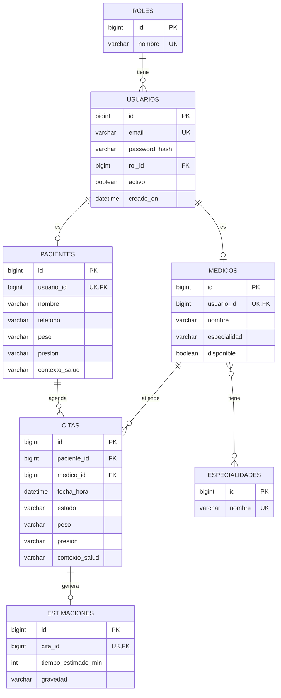

# SaludOAX

Sistema de gestión de citas médicas con estimación de tiempo de consulta y
gravedad asistida por IA. Resuelve la incertidumbre que enfrentan los
pacientes en clínicas donde no existe un tiempo estimado por consulta,
evitando que pierdan su turno por ausentarse brevemente.

## Integrantes

- [Nombre completo integrante 1]
- [Nombre completo integrante 2]

## Tecnologías utilizadas

| Capa | Tecnología |
|---|---|
| Backend | Spring Boot 3.3, Java 17, Spring Security + JWT |
| Base de datos | MySQL 8.0, Flyway (migraciones versionadas) |
| Frontend | React 18 (Vite), Axios, React Router |
| Diseño | Figma |
| Pruebas de API | Bruno |
| Despliegue | VPS propio, Nginx, Let's Encrypt (Certbot) |
| Comunicación | Postfix (correo), Twilio (SMS/WhatsApp) |

## Estructura del repositorio

```
SaludOAX-App-Web/
├── backend/     → API REST en Spring Boot
├── frontend/    → Aplicación React
├── bruno/       → Colección de pruebas de API (se agrega en Fase 3)
└── docs/        → Contrato de DTOs y documentación de apoyo
```

## Instrucciones de instalación

### Backend

```bash
cd backend
cp src/main/resources/application.properties.example src/main/resources/application.properties
# edita application.properties con tu usuario/password de MySQL y un jwt.secret propio
./mvnw spring-boot:run
```

Requiere una base de datos MySQL creada previamente:
```sql
CREATE DATABASE saludoax;
```

Flyway crea el esquema automáticamente al arrancar. Al iniciar por primera
vez, `DataSeeder` carga datos de prueba (pacientes, médicos, citas).

### Frontend

```bash
cd frontend
cp .env.example .env
npm install
npm run dev
```

## Credenciales de prueba (usuario administrador de evaluación)

| Rol | Email | Password |
|---|---|---|
| ADMIN | admin@saludoax.com | Admin123! |
| PACIENTE | paciente1@correo.com | Paciente123! |
| MEDICO | medico1@saludoax.com | Medico123! |

## Diagrama Entidad-Relación



Relación N:M: `medicos` — `especialidades`, a través de la tabla intermedia
`medico_especialidades` (un médico puede tener varias especialidades, una
especialidad puede ser cubierta por varios médicos).

Contrato completo de campos entre backend y frontend: ver
[`docs/DTO_CONTRACT.md`](docs/DTO_CONTRACT.md).

## URL base de la API

`http://localhost:8080/api` (local) — se actualizará con la URL del VPS
en HTTPS antes de la entrega final.

## Links

- Tablero de GitHub Projects: [pendiente — pegar aquí]
- Prototipo de Figma: [pendiente — pegar aquí]
- Proyecto desplegado (VPS, HTTPS): [pendiente — pegar aquí]

## Estado del desarrollo

- [x] Fase 0 — Fundación compartida (auth JWT, roles, MySQL, Flyway)
- [x] Flujo A — Pacientes y Citas (CRUD, paginación server-side)
- [ ] Flujo B — Médicos, estimación por IA, sala de espera
- [ ] Comunicación (correo, SMS, WhatsApp)
- [ ] Diseño en Figma
- [ ] Pruebas con Bruno
- [ ] Despliegue en VPS con HTTPS
