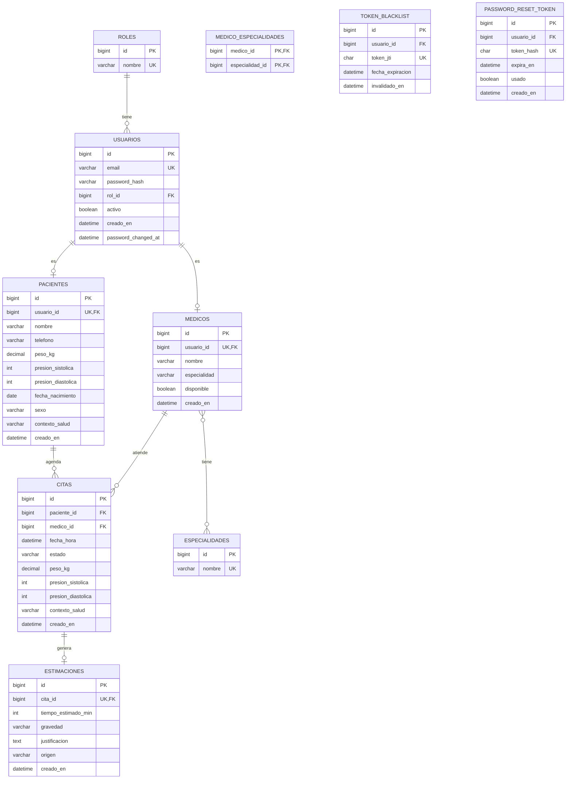

# SaludOAX

Sistema de gestión de citas médicas con estimación de tiempo de consulta y
gravedad asistida por IA. Resuelve la incertidumbre que enfrentan los
pacientes en clínicas donde no existe un tiempo estimado por consulta,
evitando que pierdan su turno por ausentarse brevemente.

## Integrantes

- Cruz Bautista Mauricio Raciel (Flujo B: Médicos + Estimación IA)
- Chavez Hernandez Luis Eduardo (Flujo A: Pacientes + Citas)

## Tecnologías utilizadas

| Capa | Tecnología |
|---|---|
| Backend | Spring Boot 3.3, **Java 21**, Spring Security + JWT |
| Base de datos | MySQL 8.0, Flyway (migraciones versionadas V1–V9) |
| Frontend | React 18 (Vite), Axios, React Router, **JavaScript (JSX)** |
| Diseño | Figma (prototipo navegable) |
| Pruebas de API | Bruno (colección en `bruno/`) |
| Despliegue | VPS propio, Nginx, Let's Encrypt (Certbot) |
| Comunicación | Postfix (correo), Twilio (SMS/WhatsApp) |

## Estado del desarrollo (26 jul 2026)

| Módulo | Estado | Detalles |
|---|---|---|
| **Fase 0 — Fundación** | ✅ **LISTO** | Auth JWT (register, login, logout, recuperar, restablecer), roles ADMIN/PACIENTE/MEDICO, BCrypt, Flyway V1–V9, DataSeeder (1 admin, 10 pacientes, 5 médicos, 6 especialidades, 10 citas), React + Axios + AuthContext + interceptor JWT |
| **Flujo A — Pacientes y Citas** | ✅ **LISTO** | Backend: `PacienteController` (CRUD + paginación server-side + filtro nombre), `CitaController` (CRUD + paginación + cambiar estado + `posicion-fila`), DTOs con Bean Validation (`@PesoValido`, `@PresionSistolicaValida`, `@PresionDiastolicaValida`). Frontend: `RegistroSalud` (crear/editar perfil con validaciones tiempo real), `MisCitas` (listado paginado + modal cancelar), `AgendarCita` (selector médico + datetime-local), rutas protegidas por rol (`/salud`, `/mis-citas`, `/agendar-cita`), `pacienteId` real del usuario autenticado vía `GET /api/pacientes/mi-perfil`. |
| **Flujo B — Médicos y Estimación IA** | 🔴 **PENDIENTE** | Migración V10 (`estimaciones.justificacion`, `origen`), Entidad `Estimacion`, `IAEstimacionService` (Groq/Gemini + WebClient + fallback determinista), `EstimacionController`, `SalaEsperaController`, `MedicoController`, `EspecialidadController`, `UsuarioController` (ADMIN). Frontend: `AgendaMedico`, `SalaEspera`, `MiEspera`, `AdminMedicos`, `AdminUsuarios`, servicios API, componentes `GravedadBadge`, `Navbar`, `Pagination`. |
| Comunicación (Postfix/Twilio) | 🔴 Pendiente | Fase 4 |
| Despliegue VPS + HTTPS | 🔴 Pendiente | Fase 5 |
| Bruno | 🔴 Pendiente | Fase 6 |
| Figma | 🟡 En progreso | Fase 1 |

## Estructura del repositorio

```
SaludOAX-App-Web/
├── backend/     → API REST en Spring Boot (Java 21)
├── frontend/    → Aplicación React + Vite (JSX)
├── bruno/       → Colección de pruebas de API (Fase 6)
├── docs/        → Contrato de DTOs (`DTO_CONTRACT.md`)
└── README.md
```

## Instrucciones de instalación

### Backend

```bash
cd backend
cp src/main/resources/application.properties.example src/main/resources/application.properties
# edita application.properties con tu usuario/password de MySQL y un jwt.secret propio (mín 64 chars)
mvn spring-boot:run
```

Requiere una base de datos MySQL creada previamente:
```sql
CREATE DATABASE saludoax;
```

Flyway crea el esquema automáticamente al arrancar (migraciones V1–V9). Al iniciar por primera vez, `DataSeeder` carga datos de prueba (pacientes, médicos, citas).

### Frontend

```bash
cd frontend
cp .env.example .env
npm install
npm run dev
```

Frontend en `http://localhost:5173`, backend en `http://localhost:8080/api`.

## Credenciales de prueba (usuario administrador de evaluación)

| Rol | Email | Password |
|---|---|---|
| ADMIN | admin@saludoax.com | Admin123! |
| PACIENTE | paciente1@correo.com | Paciente123! |
| MEDICO | medico1@saludoax.com | Medico123! |

## Endpoints principales implementados (Fase 0 + Flujo A)

| Módulo | Método | Endpoint | Roles | Descripción |
|---|---|---|---|---|
| Auth | POST | `/api/auth/register` | Público | Registro (asigna PACIENTE) |
| Auth | POST | `/api/auth/login` | Público | Login → devuelve JWT |
| Auth | POST | `/api/auth/logout` | JWT | Logout + blacklist `jti` |
| Auth | POST | `/api/auth/recuperar` | Público | Solicita reset (anti-enumeración) |
| Auth | POST | `/api/auth/restablecer` | Público | Restablece con token |
| Pacientes | GET | `/api/pacientes` | ADMIN, MEDICO | Listado paginado + `?nombre=` |
| Pacientes | GET | `/api/pacientes/{id}` | ADMIN, MEDICO, PACIENTE | Detalle |
| Pacientes | **GET** | **`/api/pacientes/mi-perfil`** | **PACIENTE** | **Perfil del usuario autenticado** |
| Pacientes | POST | `/api/pacientes` | PACIENTE | Crear perfil (valida vitales) |
| Pacientes | PUT | `/api/pacientes/{id}` | ADMIN, PACIENTE | Actualizar perfil |
| Pacientes | DELETE | `/api/pacientes/{id}` | ADMIN | Eliminar |
| Citas | GET | `/api/citas` | ADMIN, MEDICO | Listado paginado + `?estado=` |
| Citas | GET | `/api/citas/paciente/{pacienteId}` | ADMIN, PACIENTE | Citas de un paciente (paginado) |
| Citas | GET | `/api/citas/medico/{medicoId}` | ADMIN, MEDICO | Citas de un médico (paginado) |
| Citas | GET | `/api/citas/{id}` | ADMIN, MEDICO, PACIENTE | Detalle |
| Citas | POST | `/api/citas` | PACIENTE, ADMIN | Crear cita (fecha futura, vitales) |
| Citas | PATCH | `/api/citas/{id}/estado` | ADMIN, MEDICO, PACIENTE | Cambiar estado |
| Citas | GET | `/api/citas/{id}/posicion-fila` | ADMIN, MEDICO, PACIENTE | Posición en cola del médico |
| Médicos | GET | `/api/medicos` | Autenticado | Listado (para selector en AgendarCita) |

## Diagrama Entidad-Relación



Relación N:M: `medicos` — `especialidades`, a través de la tabla intermedia
`medico_especialidades` (un médico puede tener varias especialidades, una
especialidad puede ser cubierta por varios médicos). Cumple el requisito
mínimo de la rúbrica.

Contrato completo de campos entre backend y frontend: ver
[`docs/DTO_CONTRACT.md`](docs/DTO_CONTRACT.md).

## URL base de la API

- Local: `http://localhost:8080/api`
- Producción: `https://<tudominio>/api` (pendiente despliegue)

## Próximos pasos (checklist Flujo A — Luis)

- [x] Endpoint `GET /api/pacientes/mi-perfil`
- [x] Rutas protegidas en `App.jsx` (`/salud`, `/mis-citas`, `/agendar-cita`)
- [x] `AgendarCita.jsx` (selector médico + datetime-local)
- [x] `MisCitas.jsx` usa `pacienteId` real del usuario autenticado
- [x] `RegistroSalud.jsx` modo crear/editar (carga perfil si existe)
- [ ] Loading states en `AgendarCita` y cancelar en `MisCitas` (parcial)
- [ ] Filtro por nombre en UI de listado pacientes (backend ya lo soporta)
- [ ] Validación solape citas mismo médico/hora (opcional)
- [ ] Casos Bruno: crear paciente, listar paginado, crear cita, cancelar cita

